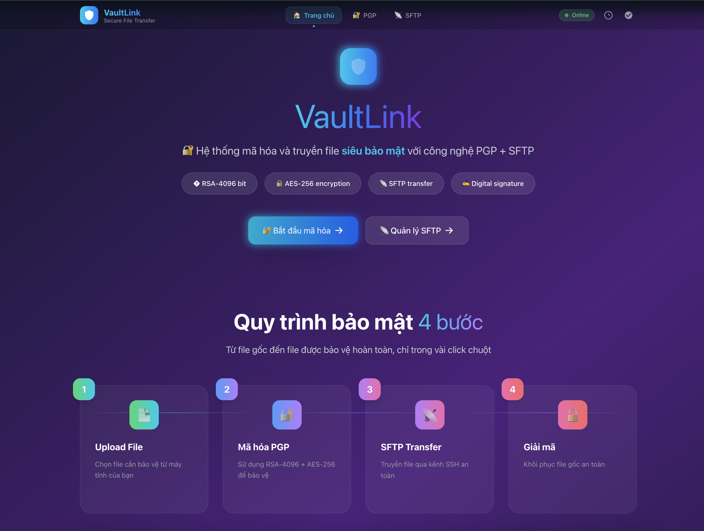
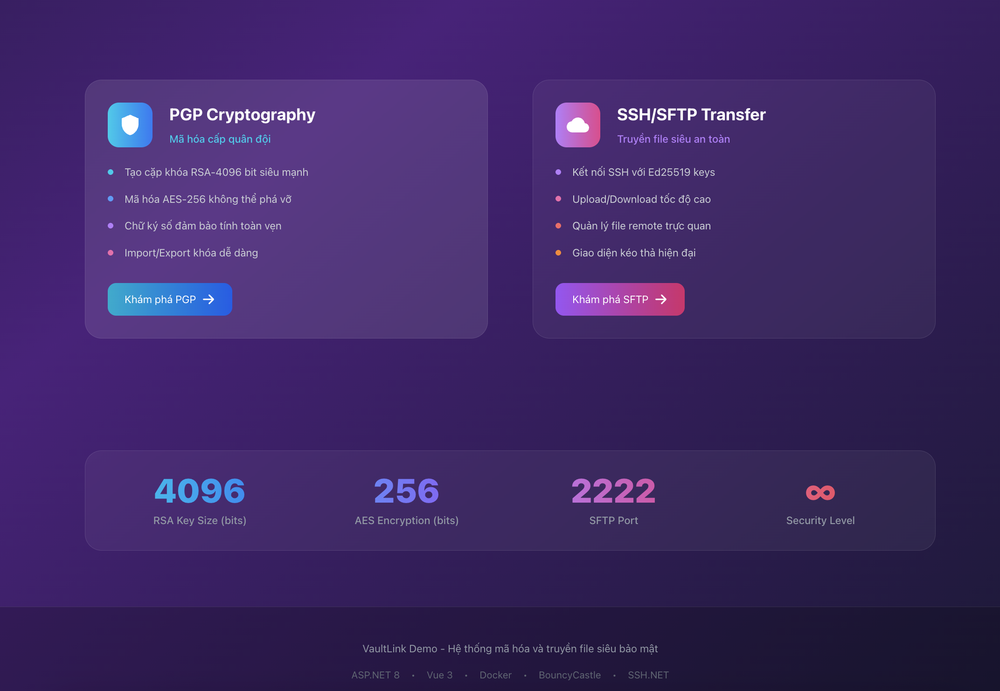

# VaultLink - PGP + SFTP Demo

A complete demonstration of PGP encryption/decryption combined with SFTP file transfer using ASP.NET 8 backend and Vue 3 frontend.

## 📸 Screenshots

### PGP Operations Interface

*Modern Vue 3 interface for PGP key generation, encryption, and decryption operations*

### SSH/SFTP Management Dashboard  

*Secure file transfer with SSH connection testing and SFTP upload/download capabilities*

## 🌟 Key Highlights

- ✅ **End-to-End Encryption**: Complete PGP workflow từ key generation đến file decryption
- ✅ **Production Ready**: Docker containerization với multi-stage builds
- ✅ **Modern UI/UX**: Vue 3 Composition API với Tailwind CSS glassmorphism design
- ✅ **Secure by Default**: Keys gitignored, passphrases in memory only
- ✅ **Full CRUD SFTP**: Upload, list, download files với proper authentication
- ✅ **Comprehensive API**: RESTful endpoints cho tất cả PGP và SFTP operations

## ✨ Features

- **🔐 PGP Operations**: Generate RSA-4096 keys, encrypt/decrypt files, digital signatures
- **📁 SFTP Transfer**: Secure file upload/download using SSH Ed25519 keys
- **🎨 Web Interface**: Clean Vue 3 + Tailwind CSS frontend with glassmorphism design
- **🐳 Containerized SFTP**: Docker Compose with atmoz/sftp server
- **🔒 Security**: Private keys in gitignored directories, in-memory passphrases

## 🏗️ Architecture

```
┌─────────────┐    ┌─────────────┐    ┌─────────────┐    ┌─────────────┐
│   Original  │    │  Encrypted  │    │    SFTP     │    │  Decrypted  │
│     File    │───▶│     File    │───▶│   Upload    │───▶│     File    │
│             │    │   (.pgp)    │    │             │    │             │
└─────────────┘    └─────────────┘    └─────────────┘    └─────────────┘
```

## 📁 Project Structure

```
vaultlink/
├─ backend/
│  ├─ Vaultlink.Api/              # ASP.NET 8 Minimal API
│  ├─ Vaultlink.Core/             # PgpService, SftpService, KeyStore
│  └─ Vaultlink.Tests/            # xUnit tests
├─ frontend/
│  ├─ index.html
│  └─ src/
│     ├─ main.js
│     ├─ App.vue
│     ├─ router/index.js
│     ├─ pages/{Dashboard.vue,Pgp.vue,SshSftp.vue}
│     └─ assets/main.css
├─ ops/
│  ├─ docker-compose.yml
│  ├─ sftp/users.conf
│  ├─ ssh/keys/                   # generated SSH keys
│  └─ scripts/{gen-ssh-key.sh,gen-gpg-key.sh}
├─ samples/{hello.txt}
├─ .env.example
└─ README.md
```

## Prerequisites

- Docker & Docker Compose
- Node.js 20+
- .NET 8 SDK
- GPG (for key generation script)

## 🚀 Quick Start

### Option 1: Docker Compose (Recommended)

```bash
# Clone and navigate to project
cd pgp-sftp-lab-demo

# Build and start all services with one command
./start.sh

# Or manually:
docker-compose build
docker-compose up -d
```

**🌐 Access URLs:**
- **Frontend**: http://localhost:5080
- **Backend API**: http://localhost:5080/health 
- **SFTP Server**: localhost:2222

### Option 2: Development Mode

### 1. Setup SFTP Server

```bash
cd ops
./scripts/gen-ssh-key.sh
./scripts/gen-gpg-key.sh
docker compose up -d
```

### 2. Run Backend

```bash
cd backend/Vaultlink.Api
dotnet run --urls http://localhost:5080
```

### 3. Run Frontend

```bash
cd frontend
npm install
npm run dev
```

### 4. Access Application

- Frontend: http://localhost:5173
- Backend API: http://localhost:5080/swagger
- SFTP Server: localhost:2222

## 🐳 Docker Deployment

### Single Command Deployment
```bash
./start.sh  # Build và start tất cả services
```

### Manual Docker Commands
```bash
# Build images
docker-compose build

# Start services 
docker-compose up -d

# View logs
docker-compose logs -f

# Stop services
docker-compose down
```

### 🛠️ Docker Services:
- **Frontend**: Nginx serving Vue 3 app on port 5080
- **Backend**: ASP.NET 8 API on port 5080  
- **SFTP**: atmoz/sftp server on port 2222

### 🎯 Container Features:
- **Volume persistence**: PGP keys và SFTP data
- **Health checks**: Automatic service monitoring
- **Network isolation**: Internal Docker network
- **Production ready**: Multi-stage builds với optimization

## 🎬 Demo Workflow

### 📥 Inbound (A→B): Client encrypts for server

1. **🔑 Generate Server Key**: Use `/pgp/generate` or dashboard to create server key pair
2. **📄 Import Client Public Key**: Import client's public key from `samples/keys/client_pub.asc`
3. **🔐 Encrypt File**: Upload `samples/hello.txt`, encrypt to server's public key
4. **📤 Upload to SFTP**: Transfer encrypted `.pgp` file to SFTP server
5. **📥 Download**: Server downloads encrypted file
6. **🔓 Decrypt**: Server decrypts with its private key and passphrase

### 📤 Outbound (B→A): Server signs and encrypts for client

1. **✍️ Sign & Encrypt**: Server signs with its private key, encrypts with client's public key
2. **📤 Upload**: Transfer to SFTP
3. **📥 Client Download**: Client downloads encrypted file
4. **🔍 Decrypt & Verify**: Client decrypts with private key, verifies server's signature

## 🔌 API Endpoints

### 🔐 PGP Operations
- `POST /pgp/generate` - Generate RSA-4096 key pair
- `POST /pgp/import-public` - Import public key (.asc file)
- `POST /pgp/import-private` - Import private key + passphrase
- `POST /pgp/encrypt` - Encrypt file with optional signing
- `POST /pgp/decrypt` - Decrypt file and verify signatures

### 📁 SSH/SFTP Operations
- `POST /ssh/test` - Test SSH connection
- `POST /sftp/upload` - Upload file via SFTP
- `POST /sftp/list` - List remote files
- `POST /sftp/download` - Download file from SFTP

## ⚙️ Configuration

### Backend (.env)
```bash
KEYSTORE_DIR=./.keys  # Where PGP keys are stored
```

### Frontend (.env)
```bash
VITE_API_BASE=http://localhost:5080
VITE_SFTP_HOST=localhost
VITE_SFTP_PORT=2222
VITE_SFTP_USER=demo
VITE_SSH_KEY=ops/ssh/keys/demo_ed25519
```

## 🔒 Security Features

- **🔐 Private Key Protection**: Keys stored in `./.keys` (gitignored)
- **🛡️ Passphrase Security**: Never logged, kept in memory only
- **✅ Integrity Checks**: AEAD encryption (AES-256 + integrity)
- **💪 Strong Crypto**: RSA-4096, AES-256, SHA-256, Ed25519
- **🚫 No Plaintext Logs**: Only fingerprints and key IDs logged

## 🔑 Sample Keys

The `ops/scripts/gen-gpg-key.sh` generates demo keys:

- **Client**: `client@example.com` (passphrase: `client123`)
- **Server**: `server@example.com` (passphrase: `server123`)

Keys are exported to `samples/keys/` for testing.

**⚠️ WARNING**: These are demo keys only! Generate new keys for production use.

## 🛠️ Development

### Backend Testing
```bash
cd backend
dotnet test
```

### Frontend Development
```bash
cd frontend
npm run dev     # Development server
npm run build   # Production build
```

### SFTP Server Management
```bash
cd ops
docker compose up -d    # Start SFTP server
docker compose logs     # View logs
docker compose down     # Stop server
```

## 🔧 Troubleshooting

### 📡 SFTP Connection Issues
- Ensure SSH keys are generated: `ops/scripts/gen-ssh-key.sh`
- Check Docker container is running: `docker ps`
- Verify key permissions: `chmod 600 ops/ssh/keys/demo_ed25519`

### 🔐 PGP Import Errors
- Check key format (ASCII armored .asc files)
- Verify passphrase for private keys
- Ensure keys are valid PGP format

### 🖥️ Backend API Errors
- Check CORS settings for frontend origin
- Verify keystore directory exists and is writable
- Check NuGet package versions compatibility

## 📄 License

This is a demonstration project for educational purposes.

## 🛠️ Tech Stack

- **Backend**: ASP.NET 8 Minimal API, BouncyCastle.Cryptography, SSH.NET
- **Frontend**: Vue 3, Vite, Tailwind CSS 3.x with Glassmorphism design
- **Infrastructure**: Docker, atmoz/sftp
- **Crypto**: RSA-4096, AES-256, Ed25519, SHA-256